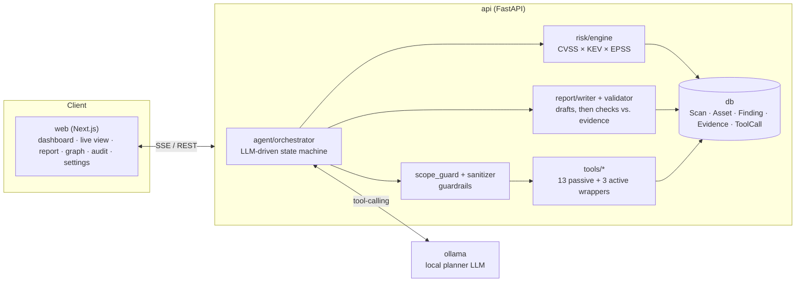

# Vigía

> External Attack Surface Management (EASM) OSINT agent, powered by a local LLM.

[](https://github.com/eduolihez/vigia/actions/workflows/ci.yml)
[](LICENSE)

*[Versión en español](README.md)*

**Status: all 9 phases done.** Base infrastructure, passive OSINT tooling, an
LLM-driven agent, a deterministic risk engine with an evidence-checked report writer, a
bilingual web GUI (core + advanced), domain-ownership-gated active mode, and a
benchmark lab that measures the agent's real OSINT quality against synthetic
ground-truth scenarios. See [CLAUDE.md](CLAUDE.md) for the phase-by-phase build log
and exact commands.

## What is Vigía?

Given a domain you own or are explicitly authorized to test, Vigía uses a local LLM
(via [Ollama](https://ollama.com); nothing leaves your machine) as an agent to
enumerate its external attack surface: subdomains, exposed services, DNS/email
misconfigurations, dangling DNS records pointing at unclaimed services, leaked
secrets, and, once domain ownership is verified, live TLS/HTTP exposure and
screenshots. Every finding is backed by stored raw evidence, prioritized with real
CISA KEV and FIRST EPSS data, and presented in a bilingual (ES/EN) web dashboard with
an asset graph, an audit trail, and an exportable, entity-validated report.

It's a portfolio project for SOC/Blue Team work: the guardrails, tests, and
documentation matter as much as the feature set. See [Guardrails](#guardrails--ethics)
below and [docs/ethics.md](docs/ethics.md) for the actual policy this tool enforces
on itself.

**Design principle:** the LLM *decides and drafts* (which tool to call next, when a
phase is done, what a report should say). Everything else, from validating that
decision to executing it, persisting evidence, scoring risk, and checking a report's
claims against real evidence, is deterministic Python. The LLM never runs arbitrary
commands and never builds tool arguments outside a fixed schema.

## Highlights

- **Agentic passive recon**: 13 passive OSINT tools (CT logs, subfinder, DNS,
  WHOIS/ASN, dangling-DNS fingerprinting, Shodan InternetDB, Censys, SPF/DKIM/DMARC,
  GitHub secret leaks, HIBP breach exposure) driven by an LLM state machine, with a
  deterministic fallback if the planner goes off the rails.
- **Active mode, gated**: TLS certificate inspection, HTTP security-header/banner
  probing, and full-page screenshots, unreachable until a DNS TXT record proves you
  control the target.
- **Deterministic risk engine**: `score = base × KEV × (1+EPSS) × exposure`, with
  real CVSS pulled from NVD when a CVE is known.
- **Evidence-checked reports**: the LLM drafts, but every domain, IP, CVE, port, or
  count it claims is checked against that scan's own stored evidence and dropped or
  regenerated if it can't be verified. Exports to Markdown, JSON, or PDF.
- **Full guardrail stack**: Scope Guard, a sanitizer for untrusted OSINT text,
  domain-ownership verification, an immutable audit log, and a prompt-injection test
  suite with 0% success across every payload it's been run against.
- **Benchmark lab**: synthetic ground-truth scenarios that run the *real* agent
  (never a real domain) and score its precision and recall. That's how a genuine
  orchestrator bug (a stalled phase silently aborting the rest of the scan) got
  caught and fixed; see [ADR-035](docs/decisions.md).

## Quickstart

### Docker Compose (everything at once)

```bash
git clone https://github.com/eduolihez/vigia.git
cd vigia
cp .env.example .env   # edit VIGIA_SECRET_KEY etc. for anything beyond local dev
docker compose up
# NVIDIA GPU host:
docker compose -f docker-compose.yml -f docker-compose.gpu.yml up
```

Then pull a tool-capable model into the `ollama` container (first run only) and open
the dashboard:

```bash
docker compose exec ollama ollama pull qwen2.5:14b-instruct   # or your preferred
                                                                # tool-calling model
```

- Web GUI: http://localhost:3000
- API: http://localhost:8000 (interactive docs at `/docs`)

### Native development

See [CLAUDE.md](CLAUDE.md#commands) for the full command reference (backend, frontend,
lint/type-check/test commands, and every CLI subcommand: `vigia scan`, `vigia
verify`, `vigia score`, `vigia report`, `vigia eval`).

## Architecture



The agent's own state machine (`VERIFY → SEED → ENUMERATE → RESOLVE → EXPOSURE →
EMAIL_AND_SPOOFING → LEAKS → RISK → REPORT → DONE`) and the full module map live in
[docs/architecture.md](docs/architecture.md).

## Guardrails & ethics

Vigía enforces on itself the same rule it asks operators to follow: it only ever
targets the domain a scan was created for, requires explicit consent before any scan
runs, and requires proof of domain ownership before anything beyond passive OSINT
lookups can execute. The full policy, the exact first-run consent text, and the
complete guardrail-to-code mapping live in **[docs/ethics.md](docs/ethics.md)**.

## Documentation

- [CLAUDE.md](CLAUDE.md): commands, conventions, phase-by-phase build log
- [docs/architecture.md](docs/architecture.md): module map, data flow, per-phase notes
- [docs/decisions.md](docs/decisions.md): ADR log (35 decisions and counting)
- [docs/ethics.md](docs/ethics.md): the policy this tool enforces on itself
- [eval/README.md](eval/README.md): the benchmark lab, how to run it and what it measures

## License

[MIT](LICENSE)
