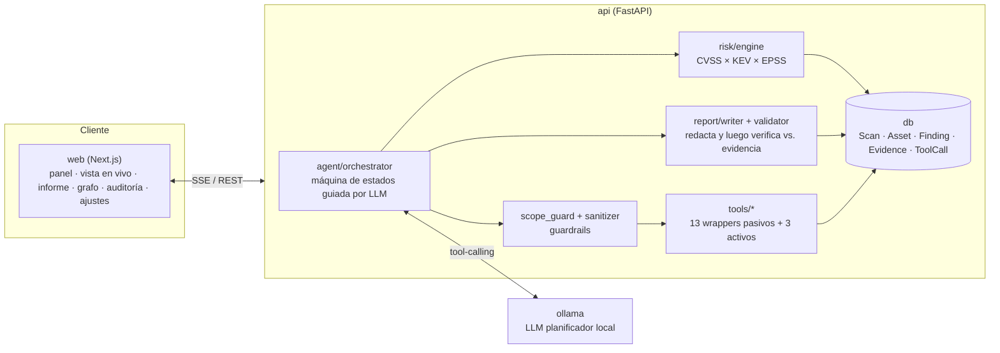

# Vigía

> Agente OSINT de superficie de ataque externa (EASM), potenciado por un LLM local.

[](https://github.com/eduolihez/vigia/actions/workflows/ci.yml)
[](LICENSE)

*[English version](README.en.md)*

**Estado: las 9 fases completadas.** Infraestructura base, herramientas OSINT
pasivas, un agente guiado por LLM, un motor de riesgo determinista con redactor de
informes verificado contra evidencia, una GUI web bilingüe (núcleo y avanzada), modo
activo protegido por verificación de propiedad de dominio, y un laboratorio de
benchmarking que mide la calidad OSINT real del agente frente a escenarios
sintéticos con verdad de referencia. Consulta [CLAUDE.md](CLAUDE.md) para el
registro fase a fase y los comandos exactos.

## ¿Qué es Vigía?

Dado un dominio propio o para el que tienes autorización explícita, Vigía usa un LLM
local (vía [Ollama](https://ollama.com), nada sale de tu máquina) como agente para
enumerar su superficie de ataque externa: subdominios, servicios expuestos, malas
configuraciones de DNS/email, registros DNS huérfanos que apuntan a servicios sin
reclamar, secretos filtrados y, una vez verificada la propiedad del dominio,
exposición TLS/HTTP en vivo y capturas de pantalla. Cada hallazgo se respalda con
evidencia en crudo almacenada, se prioriza con datos reales de CISA KEV y FIRST EPSS,
y se presenta en un panel web bilingüe (ES/EN) con un grafo de activos, un registro
de auditoría y un informe exportable y validado contra evidencia.

Es un proyecto de portfolio para trabajo de SOC/Blue Team: los guardrails, los tests
y la documentación importan tanto como las funcionalidades. Consulta
[Guardrails](#guardrails--ética) más abajo y [docs/ethics.md](docs/ethics.md) para la
política real que esta herramienta se impone a sí misma.

**Principio de diseño:** el LLM *decide y redacta* (qué herramienta llamar a
continuación, cuándo una fase ha terminado, qué debe decir un informe). Todo lo demás,
desde validar esa decisión hasta ejecutarla, persistir evidencia, puntuar el riesgo
y comprobar las afirmaciones de un informe contra evidencia real, es Python
determinista. El LLM nunca ejecuta comandos arbitrarios ni construye argumentos de
herramientas fuera de un schema fijo.

## Puntos destacados

- **Reconocimiento pasivo agéntico**: 13 herramientas OSINT pasivas (logs CT,
  subfinder, DNS, WHOIS/ASN, huella de DNS huérfano, Shodan InternetDB, Censys,
  SPF/DKIM/DMARC, secretos filtrados en GitHub, exposición en brechas vía HIBP)
  dirigidas por una máquina de estados LLM, con un fallback determinista si el
  planificador se descarría.
- **Modo activo, protegido**: inspección de certificados TLS, sondeo de
  cabeceras de seguridad/banner HTTP y capturas de pantalla completas, inalcanzable
  hasta que un registro TXT de DNS demuestre que controlas el objetivo.
- **Motor de riesgo determinista**: `score = base × KEV × (1+EPSS) × exposición`,
  con CVSS real extraído de NVD cuando se conoce un CVE.
- **Informes verificados contra evidencia**: el LLM redacta, pero cada dominio, IP,
  CVE, puerto o recuento que afirma se comprueba contra la evidencia almacenada de ese
  escaneo y se descarta o regenera si no puede verificarse. Exporta a Markdown, JSON
  o PDF.
- **Stack de guardrails completo**: Scope Guard, un sanitizer para texto OSINT no
  confiable, verificación de propiedad de dominio, un registro de auditoría
  inmutable y una batería de pruebas de inyección de prompts con 0% de éxito en
  todos los payloads con los que se ha probado.
- **Laboratorio de benchmarking**: escenarios sintéticos con verdad de referencia
  que ejecutan al agente *real* (nunca un dominio real) y puntúan su
  precisión y exhaustividad. Así se detectó y corrigió un bug real del orquestador
  (una fase estancada abortaba silenciosamente el resto del escaneo); consulta
  [ADR-035](docs/decisions.md).

## Inicio rápido

### Docker Compose (todo de una vez)

```bash
git clone https://github.com/eduolihez/vigia.git
cd vigia
cp .env.example .env   # edita VIGIA_SECRET_KEY, etc. para cualquier uso más allá de local
docker compose up
# Host con GPU NVIDIA:
docker compose -f docker-compose.yml -f docker-compose.gpu.yml up
```

Después, descarga un modelo compatible con tool-calling en el contenedor `ollama`
(solo la primera vez) y abre el panel:

```bash
docker compose exec ollama ollama pull qwen2.5:14b-instruct   # o el modelo con
                                                                 # tool-calling que prefieras
```

- Panel web: http://localhost:3000
- API: http://localhost:8000 (docs interactivas en `/docs`)

### Desarrollo nativo

Consulta [CLAUDE.md](CLAUDE.md#commands) para la referencia completa de comandos
(backend, frontend, lint/type-check/test, y cada subcomando de la CLI: `vigia
scan`, `vigia verify`, `vigia score`, `vigia report`, `vigia eval`).

## Arquitectura



La máquina de estados propia del agente (`VERIFY → SEED → ENUMERATE → RESOLVE →
EXPOSURE → EMAIL_AND_SPOOFING → LEAKS → RISK → REPORT → DONE`) y el mapa completo de
módulos están en [docs/architecture.md](docs/architecture.md).

## Guardrails & ética

Vigía se impone a sí mismo la misma regla que pide a los operadores: solo apunta
nunca al dominio para el que se creó un escaneo, exige consentimiento explícito
antes de que corra cualquier escaneo, y exige prueba de propiedad del dominio antes
de que se ejecute nada más allá de las consultas OSINT pasivas. La política completa,
el texto exacto de consentimiento de primer uso, y el mapeo completo de guardrail a
código están en **[docs/ethics.md](docs/ethics.md)**.

## Documentación

- [CLAUDE.md](CLAUDE.md): comandos, convenciones, registro fase a fase
- [docs/architecture.md](docs/architecture.md): mapa de módulos, flujo de datos, notas por fase
- [docs/decisions.md](docs/decisions.md): registro de ADRs (35 decisiones y contando)
- [docs/ethics.md](docs/ethics.md): la política que esta herramienta se impone a sí misma
- [eval/README.md](eval/README.md): el laboratorio de benchmarking, cómo ejecutarlo y qué mide

## Licencia

[MIT](LICENSE)
